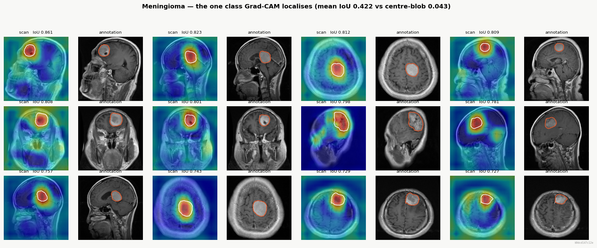

# Brain Tumour Typing — a CNN built from scratch, and audited like it might be wrong

A convolutional network that classifies brain MRI slices as **glioma**,
**meningioma** or **pituitary** tumour. No pretrained backbone: every weight is
Kaiming-initialised and learned from this dataset.

The point of the project is not the accuracy. It is that the accuracy comes with
the measurements needed to decide whether to believe it.

```
macro F1   0.8711    95% CI [0.8445, 0.8959]     <- the headline
accuracy   0.8793    95% CI [0.8532, 0.9038]
macro AUC  0.9800

613 held-out scans from 47 patients, disjoint from training and validation
run b9dcd147c12e
```

---

## Read the headline with these three numbers beside it

A single accuracy figure on a curated MRI benchmark is close to meaningless on
its own. These are the qualifiers, all measured rather than asserted.

| | |
|---|---|
| **Margin over a texture probe** | **+0.2102** |
| Five pixel statistics — brightness, contrast, Laplacian variance, gradient energy, high-frequency share — with no spatial structure at all, score 0.6691 under patient-wise folds. That margin, not the headline, is the part attributable to learned structure. | |
| **Worst case under corruption** | **0.4441 macro F1** |
| A 2px blur roughly halves performance. Clean-data accuracy is not a deployment number. | |
| **Localisation** | **one class of three** |
| Grad-CAM beats a centre-blob control for meningioma (+0.3797 IoU) and *loses* to it for pituitary (−0.0749). The heatmaps are not evidence the model finds tumours in general. | |

---

## What this is, and what it deliberately is not

**Tumour typing, not detection.** There is no healthy class, and that is a
measured decision rather than an oversight.

The Cheng collection ships no healthy scans, so a fourth class has to come from
a second collection. Two were tried. A random forest given only those five pixel
statistics separates the tumour source from the healthy source at **0.9717**
(Br35H) and **0.9243** (IXI) against 0.5000 chance. Intensity standardisation
and a matched JPEG round-trip pull both to a **~0.92 floor** and no further.

Two unrelated healthy collections, four normalisation attempts, one answer:
*which dataset is this* is legible in the pixels. A detector trained that way
reads provenance instead of anatomy — which is exactly how the previous version
of this project failed, scoring 0.974 on 512×512 scans and **0.258** on
everything else.

So the healthy class was dropped rather than shipped with a caveat.

---

## Quickstart

```bash
pip install -r requirements.txt
```

Place the [figshare Cheng et al. (2017)](https://figshare.com/articles/dataset/brain_tumor_dataset/1512427)
`.mat` files in `data/raw/cheng/`, then:

```bash
python run_all.py
```

That executes the five notebooks in order and checks each exit code separately.
To run one phase:

```bash
jupyter nbconvert --to notebook --execute --inplace notebooks/01_data.ipynb
```

Grad-CAM galleries (needs a checkpoint from Phase 3):

```bash
python make_gradcam_gallery.py
```

Nothing is cached. `build_dataset` reads all 3,064 HDF5 files on every call
(~20s) and writes nothing, because a stale `.npz` is indistinguishable from a
fresh one at the call site.

---

## The dataset

**figshare Cheng et al. (2017)** — 3,064 T1-weighted contrast-enhanced slices,
**233 patients**, two hospitals, one acquisition protocol, every image 512×512.
Axial, coronal and sagittal planes are all present.

Each `.mat` file (MATLAB v7.3, so HDF5) carries two things that make this
project possible:

- **A patient ID.** One patient contributes a median of 13 near-identical
  slices, so a random split puts near-copies on both sides. With an identifier
  they are never separated — the leak is *prevented*, not bounded.
- **A pixel-wise tumour mask** drawn by a radiologist, which turns every
  attention claim from an impression into a measurement.

```
glioma      1426        train  2099 images / 159 patients
meningioma   708        val     352 images /  27 patients
pituitary    930        test    613 images /  47 patients
------------------      imbalance 2.01:1
total       3064        duplicates found: 0
```

Zero duplicates — and that is a measured result, not an absence of checking. The
identical check removed 293 leaked test images from the previous dataset.

---

## Pipeline

| Phase | Notebook | What it establishes |
|---|---|---|
| 1 | `01_data.ipynb` | Audit before training, patient-wise split, hard gates, run manifest |
| 2 | `02_model.ipynb` | Architecture, parameter budget, receptive field, recorded prediction |
| 3 | `03_train.ipynb` | Two controls, measured class balancing, the shipped checkpoint |
| 4 | `04_ablation.ipynb` | One factor at a time against a five-seed noise floor |
| 5 | `05_evaluation.ipynb` | Test set opened once; baselines, robustness, occlusion, Grad-CAM |

Every phase ends in assertions that fail loudly. Logic lives in `src/`, not in
notebook cells — it lived in cells once, a stale editor tab wrote an older copy
back to disk, and the run that followed looked entirely normal while reporting a
better number.

### Architecture

```
1 → 32 → 64 → 128 → 256 → global average pool → 128 → 64 → 3

ConvBlock = Conv2d(bias=False) → BatchNorm2d → ReLU, Kaiming init

               parameters   receptive field
deep=False        429,667        38px of 128
deep=True       1,167,715        62px of 128    <- shipped
```

`bias=False` because BatchNorm subtracts the batch mean on the next line.
Global average pooling rather than flatten, so the head's input size does not
depend on input resolution and the resolution ablation needs no architectural
change.

---

## What was found, including the negative results

### The two controls that make the curves believable

```
memorise 48 images        train acc 1.0000            gradients flow
shuffled labels           val acc 0.4631, macro F1 0.2110
  no-information level    majority class 0.4631, ceiling 0.5428
```

With labels shuffled the model scored *exactly* the majority-class rate and a
macro F1 of 0.2110 — the value a fully collapsed predictor gets. It learned
nothing. That is the no-leakage claim tested against the model rather than the
pixels.

The no-information level is **not** 1/K. On an uneven split a model that learned
nothing still maximises accuracy by collapsing onto the largest class, so the
ceiling is computed from the class balance plus three standard errors.

### Ablation: nothing helped, four things hurt

Five seeds give a noise floor of sd 0.0084, so the signal threshold is 0.0168.

```
label smoothing 0.1        +0.0114   undetermined
deeper (RF 38→62px)        +0.0107   undetermined
weight decay 1e-4          +0.0097   undetermined
dropout 0.4                -0.0077   noise
activation ELU             -0.0091   undetermined
resolution 192             -0.0212   hurts
augment (affine only)      -0.0410   hurts
augment (affine+jitter)    -0.0569   hurts
corruption aug             -0.0739   hurts
```

**The Phase 2 prediction was not confirmed.** It was recorded before the
measurement — that the deeper variant would win on receptive field — and it
measured +0.0107 against a 0.0168 bar. Undetermined, in the predicted direction,
not resolvable at this sample size. "Undetermined" is a statement about the
study's power, not about the factor.

Class balancing was re-measured rather than inherited, and `None` won again
(0.8371 macro F1 vs weights 0.8201, sampler 0.8327, undersample 0.7849).

### Does the model need the tumour?

Blank the radiologist's mask and re-score, against the same mask *translated*
elsewhere in the brain — identical area, outline and edge length, differing only
in location.

```
occluded region              mean p(true)     drop
nothing                            0.8122
the annotated lesion               0.7665   0.0457
matched region elsewhere           0.8112   0.0010

lesion minus control   +0.0447   SE 0.0097   4.6 standard errors
lesion hurts more in   0.613 of 457 scans
```

Two claims, and both belong here. The gap is 4.6 standard errors from zero, so
the model **does** use the lesion on average. But blanking the tumour entirely
leaves p(true) at 0.7665 — down only 5.6% relative — and the per-scan win rate
is 0.613. **Most of the model's confidence survives removing the tumour**, which
is what the anatomy oracle predicted: in this collection, tumour mask centroid,
area and extent alone predict class at 0.7063.

### Grad-CAM: the layer was measured, not chosen

All five convolutional stages were swept against the masks using area-matched
IoU, with a centre-blob control.

```
layer         resolution      IoU   vs blob
centre blob           --   0.0813
block2             64x64   0.0107   -0.0706
block3             32x32   0.0159   -0.0655
block3b            32x32   0.0513   -0.0300
block4             16x16   0.0476   -0.0338
block4b            16x16   0.1601   +0.0788   <- shipped
```

**The finest stage is the worst by fifteen-fold and the coarsest is the best** —
the opposite of the intuition that a higher-resolution map localises better.
Early layers have resolution but nothing class-specific to say. Whatever limits
localisation here, it is not the 16×16 grid.

Read per class, not overall:

```
                    overall    glioma  meningioma   pituitary
centre blob          0.0813    0.0364      0.0427      0.1806
Grad-CAM block4b     0.1601    0.0652      0.4223      0.1057
difference          +0.0788   +0.0288     +0.3797     -0.0749
```

Meningioma is localised genuinely and well. **Pituitary is localised worse than
a Gaussian blob that knows nothing** — sellar tumours sit at the slice centre by
anatomy, so pointing at the middle is already an excellent pituitary detector
and the model never had to learn to find one. The occlusion map, an independent
method, reaches the same verdict.

Two implementation details make this a measurement rather than a picture:
**area-matched IoU** (a fixed threshold caps IoU at ~0.08 when masks average
2.4% of the frame) and the **centre-blob control**. Grad-CAM itself is
[pytorch-grad-cam](https://github.com/jacobgil/pytorch-grad-cam); the controls
are local, because the library does not provide them.



### Robustness, and one diagnostic row

```
clean                   0.8711
bias field ±20%         0.8713    -0.0002
noise sigma=5           0.8556    +0.0154
blur radius 1px         0.7549    +0.1162
gamma 0.7               0.6529    +0.2182
gamma 1.4               0.5230    +0.3481
noise sigma=15          0.4860    +0.3851
blur radius 2px         0.4441    +0.4269
```

Bias field is the most MRI-specific corruption here and the model does not
notice it at all, while noise and blur — which attack high-frequency texture —
are devastating. That is evidence the model leans on fine texture rather than
low-frequency anatomy, consistent with the texture probe reaching 0.6691 in the
first place.

### Does it only find large tumours? No.

```
small  (bottom third)   0.8829     against 0.8793 overall
medium (middle third)   0.8480
large  (top third)      0.9069
```

---

## Reproducibility

Every run writes `outputs/run_manifest.json`: dataset digest, split digest, git
SHA, the full config, and a content-derived short hash. That hash is **stamped
on every figure** and **embedded in every checkpoint**.

```
dataset_hash  bc41cbf1f869ebb1
split_hash    02b0799a48a71b69
run           b9dcd147c12e
```

This exists because two figures from two different checkpoints once sat in an
outputs folder looking equally authoritative and disagreeing with each other.
Phase 5 refuses to score a checkpoint whose manifest does not match.

The split is a deterministic function of the `.mat` files and the seed. It was
verified: after the caches were deleted mid-session and rebuilt from scratch,
both digests came back identical.

---

## Limitations

1. **Class is strongly determined by anatomy here.** Mask geometry alone
   predicts it at 0.7063 and five pixel statistics reach 0.6691. Quote the
   margin over the probe, not the headline.
2. **Only 47 test patients.** The honest denominator is patients, not the 613
   slices — one patient contributes a median of 13 correlated scans. The
   bootstrap intervals resample images and are therefore optimistic.
3. **Uneven test set** (286 glioma to 142 meningioma), which is why macro F1
   leads and accuracy follows. Meningioma's weakness is precision (0.6878), not
   recall (0.9155): it is over-predicted, absorbing 38 gliomas and 21 pituitaries.
4. **Clean-data performance.** The 0.4441 worst case is the number any
   deployment claim must be made against.
5. **Single split, single seed.** Intervals capture test-set sampling, not
   run-to-run variation — Phase 4 measured that separately at sd 0.0084.
6. **One collection, one protocol**, all T1-weighted contrast-enhanced. Nothing
   here speaks to other sequences, scanners or populations.
7. **Localisation is class-dependent and mostly absent.** Do not present the
   heatmaps as evidence the model finds tumours in general.
8. **Not a clinical result.** Retrospective scans, scored offline, no comparison
   against radiologist performance, no prospective validation.

### Known inconsistency

Phase 3 ships with `augment=True`, while Phase 4 measures augmentation as the
most harmful factor tested (−0.0569). The two disagree and the data does not
settle it: the ablation ran 750 images for 25 epochs, a budget that penalises
regularisers, while Phase 3 had 2,099 images and early stopping. One run with
`augment=False` at Phase 3's exact settings would isolate it. Not yet done.

---

## Layout

```
src/
  config.py       every hyperparameter, exactly once
  sources.py      Cheng .mat reader; masks follow identical geometry
  splits.py       patient-wise three-way split, gates, exclusion record
  data.py         caching, duplicate detection, transforms, balancing
  model.py        ConvBlock, BrainTumourCNN, MLPHead, receptive_field
  engine.py       training loop, checkpointing, one-shot experiments
  metrics.py      macro-first scoring, bootstrap intervals, ROC
  explain.py      brain mask, occlusion, Grad-CAM, centre blob, IoU
  robustness.py   acquisition-variation corruption suite
  audit.py        pre-training shortcut probes
  viz.py          figures, each stamped with its run hash
  manifest.py     the run record
notebooks/        phases 1-5, thin: they orchestrate, src/ decides
outputs/          figures, checkpoint, manifest, exclusion record
run_all.py        runs every notebook, checks each exit code separately
make_gradcam_gallery.py
```

## Data

Cheng, J. et al. (2017). *Brain Tumor Dataset.* figshare.
<https://doi.org/10.6084/m9.figshare.1512427.v5> — CC BY 4.0.
